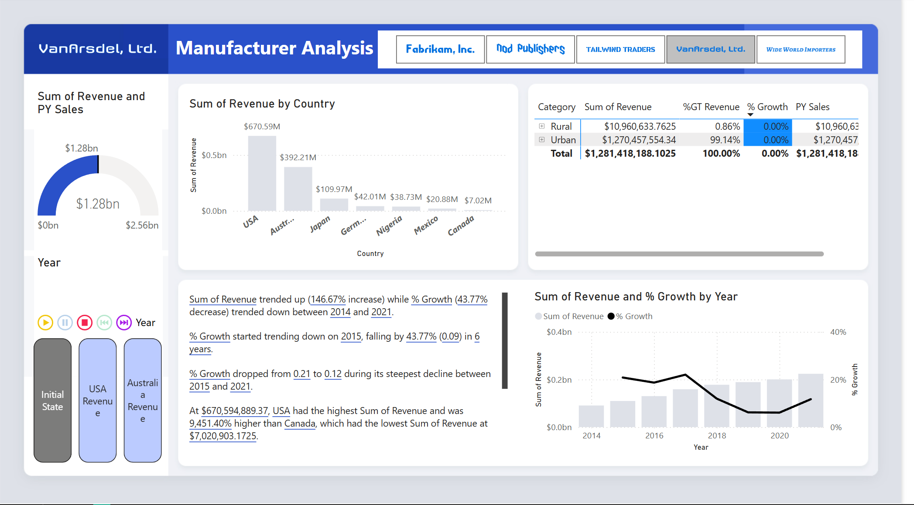
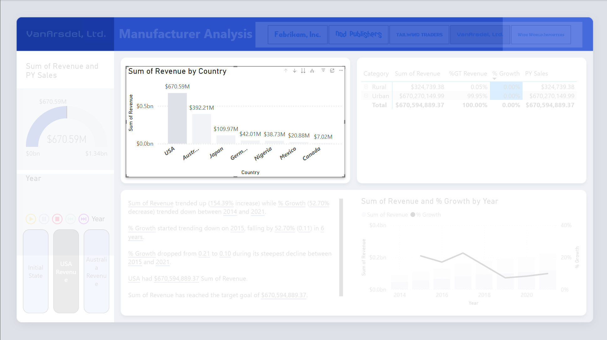
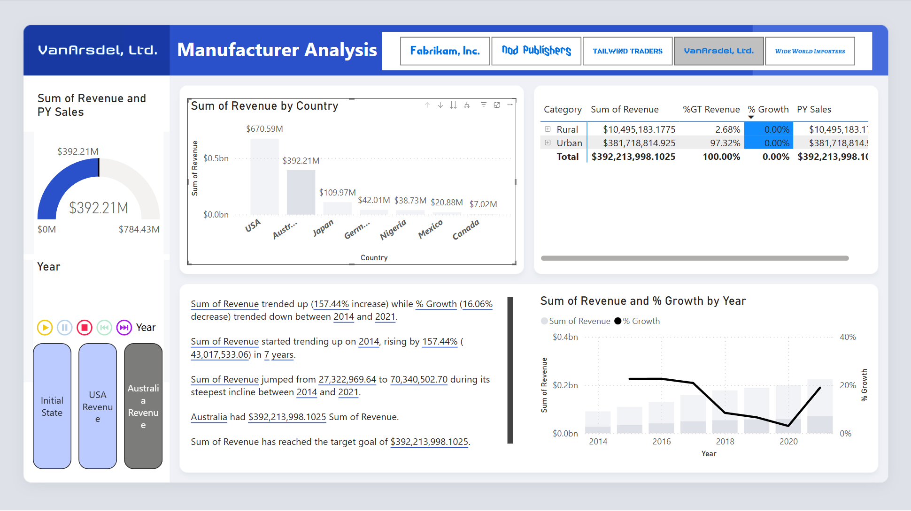

# Manufacturers-Analysis-
📊 Analysis of Manufacturers and Market Performance Across Countries – Power BI
-Conducted a comprehensive analysis of various manufacturers and their market presence across multiple countries using Power BI.

-Focused on evaluating the growth trajectory of a specific manufacturer by analyzing performance trends across regions.

-Created comparative visuals showing year-over-year product growth percentages to highlight market dynamics and identify high-performing segments.

Created interactive bookmarks to showcase critical findings in market analysis dashboards.

